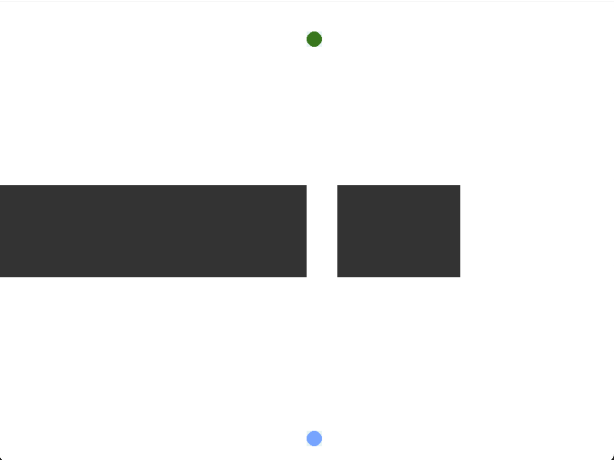
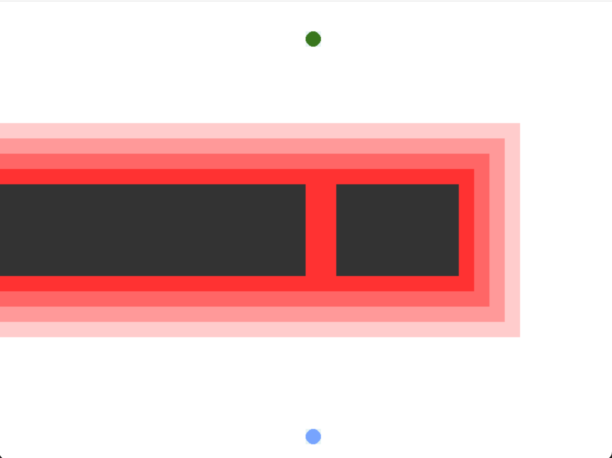
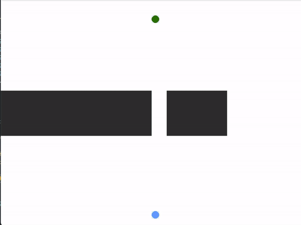
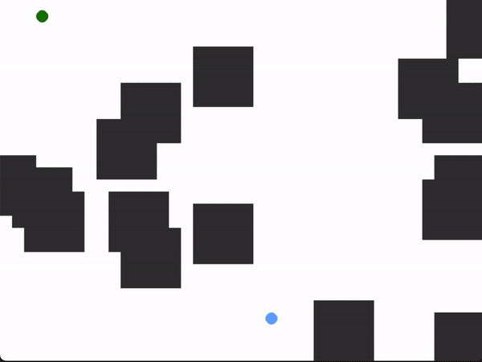

# DontGoToClose

DontGoToClose is a tiny little project to visualize path finding algorithms in a setting where the vicinity to an obstacle increase the cost of the path.

For example, take the following problem:

Obviously, the shortest path would be to go straight up through the small tunnel. However, if we add to the problem a penalty on paths close to obstacles our problem changes. Below we can see these penalties visualized ( darker red meaning more penalty)

If we then run the an algorithm to find the shortest path, we can see the shortest path is not just straight up.

We might find problems like this in various areas. For example when we want to navigate through a crowded area with a car, or chose the fastest path to a location given that we want to avoid some areas (due to example heavy traffic), or in a game where we would want our AI to avoid enemies!

# How to run

Note! Currently, there is only support for example1 map and Djikstra algorithm

    python run.py -map example1 -max_distance 5 -show_distance -penalty_cost 5 -algo Djikstra

#### What is max_distance and penalty_cost?
the max_distance argument determines how many grids from an obstacle should be penalized, while penalty_cost decided the cost to hit the obstacle.

So, the cost of moving to a grid is no longer 1, as it would be in a normal setting, but instead calculated in the following way:

    1 + (penalty_cost * normalized_distance)

For example, if max_distance = 5, penalty_cost = 5 and we are the grid we are evaluating is one step away from an obstacle, the cost of going to that grid will be:

    5 = 1 + (5 * (1-(1/5))) 

# Example on a random generated map:

    python run.py -map random -random_seed 9999

## TODO

- fix so that start and goal is not "locked" in when generating a random map
- fix bug where start and end end up in a wall
- add A*
